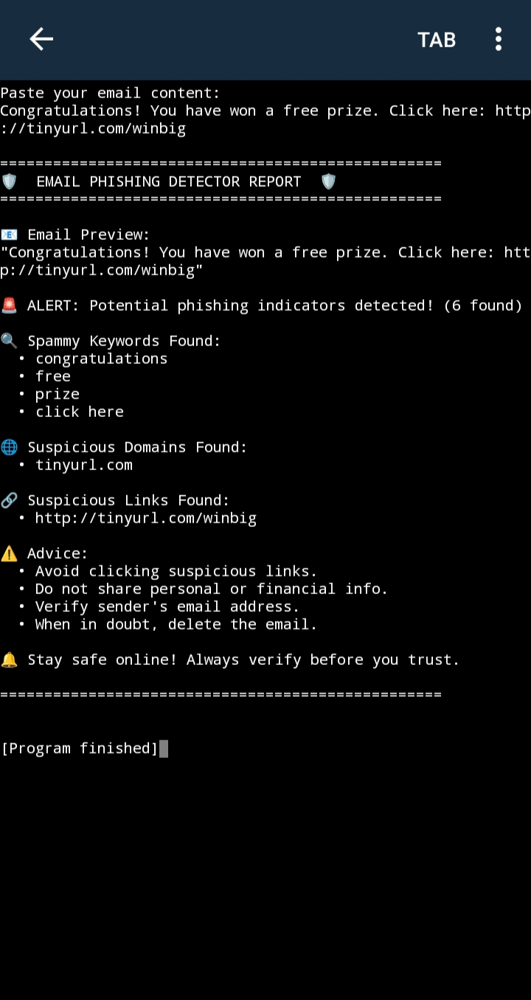

# Email Phishing Detector

A simple Python script that analyzes email text to detect phishing attempts by identifying spam keywords, suspicious domains, and links.

---

## Features

- Detects common **spammy keywords** like "free", "winner", "urgent", etc.
- Flags known **suspicious domains** such as `bit.ly`, `tinyurl.com`.
- Finds and lists **links** present in the email.
- Provides a detailed and user-friendly phishing report.
- Accepts **email content as input** from the user.

---

## Sample Output



---

## How to Run

### On Mobile (Pydroid 3)

1. Install [Pydroid 3](https://play.google.com/store/apps/details?id=ru.iiec.pydroid3) from the Google Play Store.
2. Open the app and create a new Python file named `phishing_detector.py`.
3. Paste the phishing detector code into the file.
4. Run the script.
5. Paste your email content when prompted to check if it is suspicious.

### On PC

Make sure Python is installed, then run:

```bash
python phishing_detector.py
